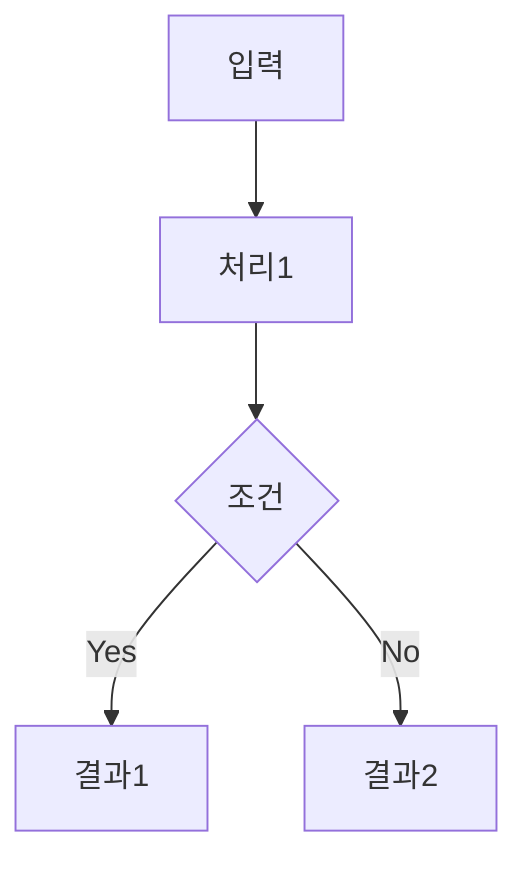

# Survey Paper Skill

arxiv 논문(또는 유사한 외부 글)을 읽고 Obsidian 서베이 노트로 변환한다.

## Workflow

```
[입력: arxiv ID/URL, 또는 arxiv 페이지 덤프, 또는 블로그/에세이 등 외부 글]
      ↓
[1] 대상 목록 추출 (단일 건이면 바로 진행)
      ↓
[1.5] 링크가 사용자가 설명한 맥락(기관·주제 등)과 실제 내용이 일치하는지 확인.
    불일치하면 그대로 진행하지 않고 사용자에게 먼저 알린다
      ↓
[2] 각 건에 대해:
    ├── 원문 다운로드 및 분석
    ├── Paper Digest 생성 (한 문단 통찰 요약) + 한눈에 요약(프레이밍 한 줄 + 3포인트) 초안
    ├── Iterative Writing으로 세부 정리
    ├── 플로우 다이어그램 생성
    └── Obsidian 페이지 저장 → Survey 폴더 (Digest 바로 아래에 한눈에 요약 블록 포함)
      ↓
[3] 읽기 가이드 생성 (5분 사전 가이드)
      ↓
[4] 품질 체크리스트 검증
      ↓
[5] 미충족 시 수정 후 재검증
      ↓
[6] 세줄 다이제스트 메시지 생성 (채팅 응답에 항상 포함, 노트에 이미 쓴 한눈에 요약을 채팅 형식으로 재사용)
```

## 다중 대상 처리

arxiv 페이지 덤프 시 목록 추출:
- 검색 결과 페이지: 제목, arxiv ID 추출
- 저자 페이지: 저자의 논문 목록 추출
- 각 건에 대해 위 workflow 반복 실행
- 사용자에게 처리할 목록 확인 후 진행

사용자가 링크와 함께 그 건에 대한 설명(기관명, 주제, 연구 방향 등)을 같이 주는 경우, 본문을 읽은 뒤 그 설명이 실제 내용과 맞는지 반드시 대조한다. 오자미리(구체적으로 서로 다른 기관·주제의 논문임을 확인한 경우)가 있으면 말없이 그대로 진행하지 말고, 불일치 내용을 먼저 사용자에게 알리고 어떻게 진행할지 확인받는다 (필요하면 AskUserQuestion 사용). 이때 사용자가 주는 맥락은 "형식만 참고"하라는 지시일 수도 있으니, 구분해서 판단한다.

## Phase 1: 원문 분석

arxiv 논문은 arxiv MCP tool로 다운로드 후 전문 읽기:
- `mcp__arxiv-mcp-server__download_paper`: 논문 다운로드
- `mcp__arxiv-mcp-server__read_paper`: 마크다운으로 읽기
- 대안으로 alphaXiv MCP tool(`mcp__alphaXiv__get_paper_content`, 필요시 `fullText: true`)도 사용 가능. 출력이 너무 커서 에러가 나면 자동 저장된 파일을 offset/limit으로 나누어 읽는다
- 비-arxiv 자료(블로그 글 등)는 WebFetch 등으로 원문을 확보한다

핵심 추출 항목:
1. **연구 동기**: 왜 이 연구를 했는가? 기존 한계는?
2. **핵심 통찰**: 남들이 놓친 것, 이 글만의 관점
3. **방법**: 통찰이 어떻게 방법으로 연결되는가
4. **결과**: 대안과의 구체적 비교 (실험 없이 이론/설계만 제시하는 글이라면 그 사실 자체를 명시)
5. **의의**: 이 연구가 열어주는 새로운 가능성

**⚠️ 섹션별 완전 요약 원칙 (Section-by-Section Coverage)**:
원문의 모든 섹션과 하위 섹션을 빠짐없이 요약해야 한다. 원문이 Section 1~7로 구성되어 있다면 서베이 노트에도 해당하는 내용이 모두 포함되어야 한다. Introduction, Related Work, Method, Experiments, Results, Discussion, Conclusion, Limitations 등 어떤 섹션도 생략하지 않는다. 이는 나중에 노트만 보고도 원문의 전체 흐름과 세부 내용을 완전히 파악할 수 있게 하기 위함이다. 각 섹션의 핵심 내용, 수치, 테이블, 주요 인사이트를 충실히 반영하고, 하위 섹션(subsection)이 있으면 그 구조도 유지하여 요약한다.

논문이 arXiv 논문이 아니라 블로그 글/에세이 등인 경우, 위 템플릿을 그 소스의 실제 구조(원문 소제목)에 맞춰 적응시킨다. arXiv 메타데이터가 없는 필드는 생략하거나 "블로그 에세이 (arXiv 논문 아님)" 같이 명시한다.

## Phase 2: Paper Digest + 한눈에 요약 생성

**Paper Digest 구조** (한 문단, 4 요소):
1. **Context**: 문제가 뭔가?
2. **Insight**: 남들이 놓친 게 뭔가?
3. **Solution**: 통찰 → 방법의 자연스러운 연결
4. **Evidence**: 대안과의 구체적 비교

**핵심 규칙**:
- 독자가 똑똑하지만 해당 분야에 익숙하지 않다고 가정
- **전문 용어 첫 등장 시 괄호로 간단 설명** 추가 (예: "ReAct(추론-행동 반복 프레임워크)")
- 구체적 예시/비유 사용 (예: "쓰레기통 역할" >> "특정 토큰에 집중")
- 인과관계 명시적으로 보여주기
- 대안과 비교/대조 ("X는 실패한 반면 Y는 성공")
- **볼드**로 2-4개 핵심 개념 강조
- **숫자에 출처 명시** (예: "93% (Table 1)")
- 원문이 실험/벤치마크 결과 없이 순수 이론·설계 명세인 경우, Digest에 그 사실을 명시적으로 밝힌다 (예: "이 보고서는 실험 결과를 제시하지 않는다").

**한눈에 요약 (프레이밍 한 줄 + 3포인트)도 이 단계에서 함께 초안을 잡는다**:
Paper Digest를 쓰면서 동시에, 이 글의 핵심을 프레이밍 한 줄과 3개 포인트로도 압축해둔다. 이건 Phase 5에서 노트의 Digest 바로 아래에 들어가고, Phase 7에서 채팅용 세줄 다이제스트로 그대로 재사용된다. 작성 원칙은 Phase 7의 "한 줄 프레이밍 작성 원칙" / "3개 포인트 작성 원칙"을 따른다 (내용은 동일, 형식만 노트용/채팅용으로 다르게 포장).

## Phase 3: Iterative Writing으로 세부 정리

**Fact Base 구축** (먼저):
- 원문에서 검증 가능한 사실만 추출
- 모든 숫자에 출처 명시
- 검증 안 된 주장은 사용 금지

**19 Principles 적용** (14 Original + 5 Naturalness):

| 카테고리 | 원칙 |
|----------|------|
| 사실성 | 모든 주장에 Fact Base 근거, 숫자는 출처 필수 (예: "93% (Table 1)") |
| 구조 | 두괄식(topic-first), 섹션 목적 명시, 의의로 마무리 |
| 이해도 | **정의 먼저** (기본 용어도 핵심 용어 정리에 포함), 비교-대조, 초심자 친화적, 논리적 흐름 |
| 형식 | 간결하게, 구체적 숫자, 산문만(bullet 금지), 추상 수준 유지 |
| 자연스러움 | 번역체 금지(NL1), 과잉 수사 금지(NL2), 한 문장 한 아이디어(NL3), 단어 반복 금지(NL4), 접속사 다양성(NL5) |

**용어 정의 우선 원칙**:
- Digest에서 전문 용어 첫 등장 시 괄호로 간단 설명
- 핵심 용어 정리 섹션에 논문의 기본 용어도 포함 (예: ReAct, trajectory)
- 해당 분야 초심자도 이해할 수 있도록 기초 개념부터 정의

**섹션 구조** (원문의 실제 섹션 구조를 그대로 반영):

서베이 노트는 원문의 섹션 번호와 제목을 그대로 따라가야 한다. 고정된 4개 섹션 대신, 원문이 가진 실제 구조(예: 1. Introduction, 2. Related Work, 3. Method, 4. Experiments, 5. Results, 6. Discussion, 7. Conclusion)를 그대로 h2/h3 헤딩으로 옮긴다. 각 섹션 내에서 핵심 내용, 수치, 테이블, 주요 인사이트를 충실히 반영하되, 하위 섹션(subsection)이 있으면 그 구조도 유지한다. 이를 통해 노트만으로 원문 전체를 재구성할 수 있어야 한다.

다만 아래 요소는 반드시 포함되어야 한다:
1. **왜 이 연구를 하는가?** (핵심 질문, 기존 한계, 핵심 통찰) — Introduction에서 추출
2. **방법 (Method)** — 플로우 다이어그램 포함
3. **발견 (Findings)** — 정량적 결과 테이블 포함 (실험이 없는 이론 논문이면 이 항목은 생략하거나 "실험 없음"을 명시)
4. **이론적 의의** — Conclusion/Discussion에서 추출

## Phase 4: 플로우 다이어그램 생성

**필수 다이어그램**:
1. **메인 프레임워크**: 전체 방법론의 핵심 흐름 (mermaid 또는 ASCII)
2. **비교 다이어그램**: 기존 방법 vs 제안 방법 (필요시)

**Mermaid 형식 예시**:


**ASCII 형식 예시**:
```
┌─────────────┐     ┌─────────────┐
│   Step 1    │ ──→ │   Step 2    │
└─────────────┘     └─────────────┘
```

방법론의 핵심 흐름을 한눈에 파악할 수 있도록 시각화한다.

## Phase 5: Obsidian 페이지 생성

**파일명 규칙**: `{핵심키워드}_{연도}_{분류}.md`
- 예: `ReTRAC_2026_DeepResearch.md`

**저장 위치**: `/Users/iamseungpil/LSP/study/Study/01_Papers/Survey/[Category]/`
- 기존 카테고리: 현재 폴더 목록을 확인해 가장 결이 맞는 카테고리를 고른다 (예: Memory, Meta-cognition, Skill_LM, Sequence_Models, Generative_Models, Scaling_Laws, Safety_Detox, Self_Improving_Agent, Competitive_Programming, AI_Safety 등)
- 적합한 카테고리 없으면 새로 생성하고, 기존의 단순 auto-query 카테고리(예: `Self_Training.md`) 스타일을 따르는 랜딩 파일 `<Category>/<Category>.md`도 함께 만든다 (frontmatter title/tags/domain + auto Obsidian `query` 블록 + "연결" 섹션에 `[[Survey Index]]` 링크)
- 새 카테고리를 만들었거나 카테고리별 논문 수가 표기되는 스타일의 인덱스 행이면, `Survey Index.md`도 갱신한다

**페이지 템플릿**:

```markdown
# {제목 한글 번역}

> **Digest**: {Paper Digest 한 문단}

> **한눈에**: {프레이밍 한 줄 — 이 논문/글이 더 큰 흐름·맥락 속에서 어떤 의미를 갖는지}
> 1. {핵심 포인트 1}
> 2. {핵심 포인트 2}
> 3. {핵심 포인트 3}

---

## 메타데이터

| 항목 | 내용 |
|------|------|
| **제목** | {원제} |
| **저자** | {저자 목록} |
| **소속** | {기관} |
| **연도** | {연도} |
| **발표** | arXiv:{ID} (비-arxiv면 "블로그 에세이 (arXiv 논문 아님)" 등으로 명시) |
| **링크** | [arXiv](URL), [GitHub](URL) |
| **키워드** | {핵심 키워드들} |

---

## 왜 이 연구를 하는가?

### 핵심 질문

{한 문장으로 핵심 질문}

### 기존 접근법의 한계

| 한계 | 설명 |
|------|------|
| ... | ... |

### 핵심 통찰

- {통찰 1}
- {통찰 2}

---

## 섹션별 상세 요약

⚠️ 아래는 예시 구조이다. 실제로는 **원문의 섹션 번호와 제목을 그대로** 사용한다.
예를 들어 논문이 "1. Introduction / 2. Related Work / 3. Method (3.1 Overview, 3.2 Module A, 3.3 Module B) / 4. Experiments / 5. Results / 6. Conclusion"으로 구성되어 있다면, 아래 헤딩도 동일하게 따라간다. 블로그 글처럼 공식 섹션 번호가 없는 글은, 원문이 실제로 쓰는 소제목을 그대로 헤딩으로 사용한다.

### {Section 1 제목} (예: Introduction)

{핵심 내용 요약}

### {Section 2 제목} (예: Related Work)

{핵심 내용 요약}

### {Section 3 제목} (예: Method)

#### {3.1 하위 섹션 제목}

{내용}

#### {3.2 하위 섹션 제목}

{내용}

### {Section 4 제목} (예: Experiments)

{벤치마크, 셋업, 베이스라인 등 — 실험이 없는 글이면 이 섹션은 생략}

### {Section 5 제목} (예: Results)

| 모델 | 메트릭1 | 메트릭2 |
|------|---------|---------|
| ... | ... | ... |

{정량적 결과에서 도출된 핵심 발견}

### {Section N 제목} (예: Conclusion)

{결론 및 향후 연구}

---

## 방법 프레임워크 다이어그램

{mermaid 또는 ASCII 다이어그램 — Method 섹션의 핵심 흐름 시각화}

---

## 이론적 의의

### {의의 1 제목}

{설명}

### {의의 2 제목}

{설명}

---

## 관련 연구

- [[관련논문1]] — 연결점 설명
- [[관련논문2]] — 연결점 설명

---

## 핵심 용어 정리

| 용어 | 정의 |
|------|------|
| ... | ... |

---

## 태그
#paper #{연도} #{분류1} #{분류2} #{핵심키워드}
```

노트의 "한눈에" 블록은 Phase 7에서 만드는 채팅용 세줄 다이제스트와 내용이 동일해야 한다(같은 프레이밍 한 줄 + 같은 3포인트). 차이는 포장뿐이다: 노트에서는 순수 Obsidian 블록쿼트(`>`)로, 제목 볼드나 `[-](url)->` 같은 채팅 전용 링크 문법 없이 쓴다. 채팅용은 Phase 7 형식을 따로 따른다.

## 카테고리 분류 기준

| 카테고리 | 키워드 |
|----------|--------|
| Memory | memory, test-time learning, context, retrieval, RAG |
| Skill_LM | reward, RL, RLHF, self-improvement, exploration, skill |
| Meta-cognition | consciousness, self-awareness, metacognition, introspection |
| Sequence_Models | architecture, recurrent, looped, state tracking, sequence modeling, latent space |
| (새 카테고리) | 위에 해당 안 되면 글의 주제로 새 폴더 생성 |

## Phase 6: 읽기 가이드 생성

서베이 노트와 별도로, 원문을 읽기 **전에** 5분간 훑어볼 사전 가이드를 생성한다. 이 가이드의 목적은 독자가 원문의 구조와 핵심을 미리 파악하여 실제 읽기의 효율을 높이는 것이다. 서베이 노트가 "읽은 후 정리"라면, 읽기 가이드는 "읽기 전 내비게이션"이다.

**생성 원칙**:
- 원문을 처음 접하는 사람이 5분 안에 읽을 수 있는 분량
- 쉬운 말투: 학술 용어를 일상 언어로 풀어서 설명
- 원문 구조의 지도 역할: 어디가 중요하고, 어디를 가볍게 넘겨도 되는지 안내
- 읽으면서 채울 수 있는 워크시트로 능동적 읽기 유도

**파일명 규칙**: `{핵심키워드}_{연도}_읽기가이드.md`
- 예: `ReTRAC_2026_읽기가이드.md`

**저장 위치**: 서베이 노트와 같은 폴더

**읽기 가이드 템플릿**:

```markdown
# 읽기 가이드: {대표 저자} ({연도})

> 이 가이드를 먼저 읽고 원문에 들어가세요. 5분이면 충분합니다.

---

## Obsidian 태그

아래 태그를 이 노트의 프로퍼티에 추가하세요:

| 태그 | 이유 |
|------|------|
| #{핵심주제} | 핵심 주제 |
| #{이론/방법명} | 다루는 이론 또는 방법 |
| #{저자핵심키워드} | 저자가 제안하는 핵심 개념 |
| #{연구유형} | 연구 유형 (실험/리뷰/이론 등) |
| #{분야} | 연구 분야 |

---

## 이 글이 뭘 하려는 건가?

{2~3문장으로 배경과 맥락을 설명. 이 분야를 모르는 사람도 "아, 그런 문제가 있구나"라고 느낄 수 있게.}

**한 줄 요약**: {글의 핵심 주장을 일상 언어로 한 문장}

---

## 논문 구조 미리보기

| 페이지/섹션 | 섹션 제목 | 역할 | 읽기 팁 |
|-------------|-----------|------|---------|
| {p.XX 또는 §1} | {섹션명} | {이 섹션이 하는 일} | {어떻게 읽으면 좋은지 조언} |
| ... | ... | ... | ... |

읽기 팁에는 다음을 포함한다:
- 가볍게/천천히/집중해서 등 속도 조절 안내
- 해당 섹션에서 특히 봐야 할 포인트 (예: "정의에 집중", "Table 3만 확인")
- ⭐ 표시로 가장 중요한 섹션 강조

---

## 미리 알아야 할 용어

| 용어 | 뜻 | 쉽게 말하면 |
|------|-----|------------|
| {영어 용어} ({한글}) | {학술적 정의} | {일상 비유나 쉬운 설명} |
| ... | ... | ... |

원문에서 사전 지식 없이 이해하기 어려운 용어만 선별한다.
"쉽게 말하면" 열에는 비유, 일상 상황, 또는 한 줄 비교를 사용한다.

---

## 워크시트: 읽으면서 채우기

원문을 읽으면서 아래 질문에 답을 적어주세요. 한두 줄이면 충분하고, 모르겠으면 `?`로 남겨두세요.

### Q1. {첫 번째 핵심 섹션 관련} ({페이지/섹션 범위})

{구체적 질문 — 해당 섹션에서 찾아야 할 핵심}

> 답:

### Q2. {두 번째 핵심 섹션 관련} ({페이지/섹션 범위})

{구체적 질문}

> 답:

{... 원문의 주요 섹션 수에 맞춰 Q3~Q6 정도까지 생성}

### Q{N-1}. 내 생각

읽으면서 가장 흥미롭거나 의문이 든 부분은?

> 답:

### Q{N}. 모르겠는 부분

이해가 안 되거나 더 설명이 필요한 부분은?

> 답:
```

**워크시트 질문 작성 규칙**:
- 각 질문은 원문의 특정 섹션/페이지를 가리켜야 한다 (어디서 답을 찾을지 명확히)
- 단순 사실 확인이 아닌 "왜?"와 "어떻게?"를 묻는 질문 위주
- 마지막 두 질문("내 생각", "모르겠는 부분")은 항상 포함하여 메타인지를 유도
- 질문 수는 원문 길이에 비례: 짧은 글(~10p)은 Q1~Q5, 긴 글(20p+)은 Q1~Q8 정도

## Phase 7: 세줄 다이제스트 메시지 생성 (항상 마지막에, 채팅 응답으로)

서베이 노트와 읽기 가이드를 만들고 전달한 뒤에는, **매번** 채팅에 바로 붙여넣을 수 있는 짧은 "세줄 다이제스트" 메시지도 함께 작성해서 응답에 포함한다. 이건 파일이 아니라 채팅 메시지 자체이며, Obsidian에 저장하는 정식 서베이 노트와는 별개의 결과물이다. 목적은 동료나 스터디 그룹에 그대로 공유할 수 있는 짧은 요약을 만드는 것이다.

이 메시지의 내용(프레이밍 한 줄 + 3포인트)은 Phase 2에서 초안을 잡고 Phase 5에서 노트의 "한눈에" 블록으로 이미 저장한 것과 동일해야 한다. Phase 7은 그 내용을 채팅용 포맷(볼드 제목, `[-](url)->` 링크)으로 다시 포장하는 단계이지, 별도의 내용을 새로 짓는 단계가 아니다.

**형식**:

```
**{논문/글 제목}**
[-]({링크})-> {한 줄 프레이밍 — 이 글이 왜 흥미로운지, 어떤 흐름/맥락 속에 있는지}

1. {핵심 기술적 포인트 1}
2. {핵심 기술적 포인트 2}
3. {핵심 기술적 포인트 3}
```

여러 건을 하나의 메시지로 묶을 때는, 링크를 나란히 이어 붙이고(`[-](url1)[-](url2)`) 제목을 "A & B" 식으로 나란히 쓴다.

**한 줄 프레이밍 작성 원칙**:
- 단순히 "이 글은 X 기관에서 나왔다" 같은 사실 나열이 아니라, 이 결과가 더 큰 흐름·트렌드·논쟁 속에서 어떤 의미를 갖는지를 짚어주는 한 문장이어야 한다
- 사용자가 대화 중에 명시적으로 밝힌 자신의 가설이나 관심사(예: "LLM이 이제 neuralese로 가고 있다", 특정 트렌드에 대한 문제의식 등)가 있고 그 글의 실제 내용이 그 가설을 뒷받침한다면, 그 키워드·프레이밍을 적극적으로 반영한다. 다만 글 내용이 실제로 그 프레이밍을 뒷받침하지 않는다면 사용자의 가설을 그대로 가져다 쓰지 말고, 글이 실제로 말하는 바에 맞는 프레이밍으로 조정한다
- 절대 원문에 없는 내용을 지어내거나 과장하지 않는다 — 이 메시지도 서베이 노트와 동일한 사실성 기준을 따른다

**3개 포인트 작성 원칙**:
- 원문의 핵심 방법/결과 중 실무적으로 참고할 만하거나 개념적으로 흥미로운 것 3가지를 고른다 (전체 요약이 아니라 발췌·선별)
- 각 포인트는 한 문장, 번역체 없이 자연스러운 한국어로 작성
- 숫자를 인용할 때는 서베이 노트와 마찬가지로 근거(표/섹션)에 부합하는 정확한 수치만 사용한다
- 원문이 실험 없는 이론/설계 글이라면, 그 사실 자체를 포인트 중 하나로 명시한다 (예: "다만 이건 전부 수식과 증명으로만 제시됐고 실측 결과는 없다")

**여러 건을 한 번에 요약할 때**:
- 여러 건이 뜻렧한 공통 주제·흐름으로 묶이는 경우(예: 여러 건이 같은 트렌드의 다른 측면을 보여줄 때), 사용자에게 건별로 각각 세줄 요약을 만들지, 하나의 통합 메시지로 묶어 소개할지 물어본다 (AskUserQuestion 사용)
- 통합 메시지로 묶기로 하면, 프레이밍 한 줄은 공통된 트렌드/통찰을 짚고, 3개 포인트는 각 건에서 하나씩 뽑거나(건이 2개일 때) 전체를 아우르는 통합된 3가지 포인트로 구성한다 — 어느 쪽이든 각 포인트가 어느 건 이야기인지 읽는 사람이 알 수 있게 자연스럽게 문맥을 넣는다
- 건들이 주제상 뚜랼이 다르면 기본값은 건별 개별 세줄 요약이다
- 이때 노트의 "한눈에" 블록(Phase 5)은 통합 여부와 무관하게 각 건마다 개별적으로 작성한다 — 노트는 한 건당 하나이므로 그 노트에 해당하는 프레이밍과 3포인트만 담는다. 채팅 메시지만 여러 건을 묶을 수 있다.

**예시** (실제 진행했던 사례, 건별 요약):

```
**NCP-ArchPreview (arXiv:2609.10715)**
[-](https://arxiv.org/abs/2609.10715)-> 사전학습 목적함수에 개념 단위 축을 하나 더 넣는 접근인데 규모가 꿤 크네요

1. 토큰 4개를 평균 풀링해 벡터양자화(코드북)로 이산화하고, 별도의 Concept Module이 다음 개념을 예측하도록 NTP와 함께 학습시켰다
2. 파라미터·연산량을 맞춘 baseline 대비로도 개선 폭이 유지돼, 단순 용량 증가가 아니라 개념 예측 구조 자체의 효과임을 어블레이션으로 확인했다
3. 사전학습 후 1,700만 파라미터짜리 VQ 모듈만 업데이트해도 LoRA·풀파인튜닝과 경쟁하는 경량 도메인 적응 인터페이스가 되고, 투기적 디코딩에 개념 표현을 얹으면 승인 길이도 늘어난다
```

예시 (공통 테마로 묶은 통합 메시지):

```
**NCP-ArchPreview & Recurrent Looped Transformer**
[-](https://arxiv.org/abs/2609.10715)[-](https://www.alphaxiv.org/abs/2609.recurrent-looped-transformer)-> 결은 다른 논문인데 같이 놓고 보니 LLM이 토큰(자연어) 대신 내부 잠재 공간에서 사고·기억하는 neuralese 쪽으로 가고 있다는 신호로 읽힙니다

1. NCP-ArchPreview는 토큰 4개를 묶어 만든 벡터양자화 코드북으로 "개념"이라는 별도의 이산 잠재 채널을 새로 만들어 토큰이 아닌 잠재 표현을 명시적 예측 목표로 승격시켰다
2. Recurrent Looped Transformer는 프롬프트·응답 구분 없이 모든 토큰에 걸쳐 연속적인 순환 은닉 상태를 그대로 이어붙여, 텍스트로 드러나지 않는 계산 경로가 시퀀스 전체에 걸쳐 쌓이게 설계했다
3. 목적은 다르지만(효율적 사전학습 vs. RL 리플레이 정합성), 두 논문 모두 사람이 읽을 수 있는 토큰 대신 압축되거나 연속적인 잠재 표현에 계산과 기억을 싣는 방향으로 아키텍처가 움직이고 있다는 공통점을 보여준다
```

## 품질 체크리스트

생성 후 자체 검증 (모두 ✅ 여야 완료):

- [ ] Digest가 Context-Insight-Solution-Evidence 모두 포함하는가?
- [ ] Digest에서 전문 용어 첫 등장 시 괄호 설명이 있는가?
- [ ] 모든 숫자에 출처가 명시되어 있는가? (예: "93% (Table 1)")
- [ ] 핵심 용어 정리에 기본 용어(예: ReAct, trajectory)도 포함되어 있는가?
- [ ] 플로우 다이어그램이 방법론 핵심을 한눈에 보여주는가?
- [ ] 기존 방법과의 비교가 구체적 수치와 함께 있는가?
- [ ] 원문의 모든 섹션과 하위 섹션이 빠짐없이 요약되어 있는가? (Section-by-Section Coverage)
- [ ] 초심자가 이 노트만 보고 원문의 왜-무엇을-어떻게를 이해할 수 있는가?
- [ ] 번역체("~함으로써", "~에 있어서")가 없는가? (NL1)
- [ ] 내용에 비해 과장된 수사("혁신적인", "관통하는")가 없는가? (NL2)
- [ ] 동사 3개 이상 나열된 과압축 문장이 없는가? (NL3)
- [ ] 인접 문장에서 같은 단어가 반복되지 않는가? (NL4)
- [ ] "그러나/따라서/또한"이 기계적으로 반복되지 않는가? (NL5)
- [ ] 읽기 가이드가 5분 내 읽을 수 있는 분량인가?
- [ ] 논문 구조 미리보기 테이블이 모든 주요 섹션을 포함하는가?
- [ ] 워크시트 질문이 원문의 핵심 섹션을 구체적으로 가리키는가?
- [ ] 노트의 Digest 바로 아래에 "한눈에" 블록(프레이밍 한 줄 + 3포인트)이 있는가?
- [ ] 세줄 다이제스트 메시지가 항상 함께 생성되었는가?
- [ ] 노트의 "한눈에" 블록과 채팅용 세줄 다이제스트의 내용(프레이밍+3포인트)이 서로 어긋나지 않고 일치하는가?
- [ ] 세줄 다이제스트의 프레이밍 한 줄과 3개 포인트가 원문의 실제 내용에 정확히 근거하는가? (과장·창작 없음)

**⚠️ 체크리스트 미충족 시**: 해당 부분 수정 후 재검증