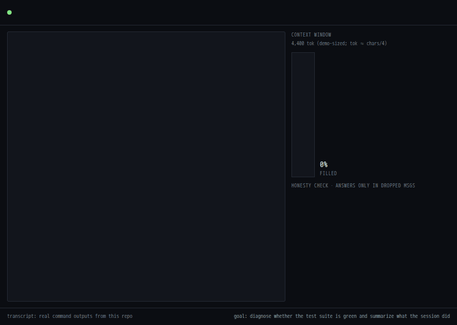
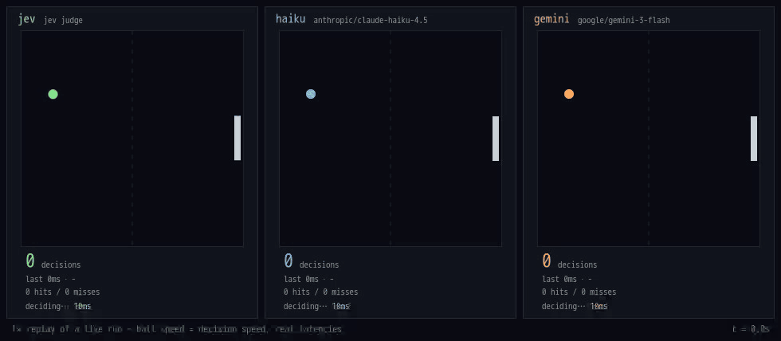
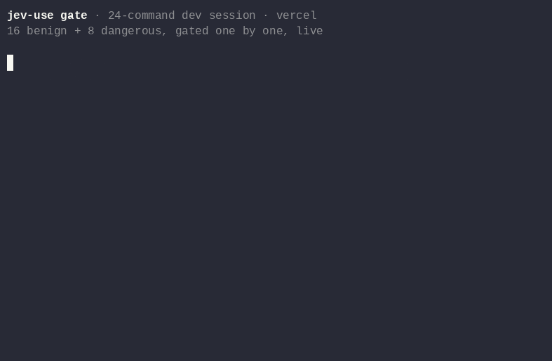

# jev-use

**English** | [简体中文](README.zh-CN.md)

The best way for Claude Code, Codex, and [pi](https://github.com/badlogic/pi-mono)
to work with [Jev](https://typesafe.ai/blog/introducing-system-one-models-and-jev):
hand the tasks that need no text output to Jev — faster steps, fewer
tokens, tasks done sooner and better.

It makes the LLM and Jev true collaborators: when content needs to be
written, the LLM takes over; when a step just needs a fast decision, Jev
executes it.

## Demos — real runs, 1× speed

<table>
<tr>
<td width="50%" valign="top"><b>Directions task: Jev clicks, the LLM types</b> — 10 decisions (p50 274 ms) · 4 writes; Jev rejects a wrong route, the LLM rewrites<br></td>
<td width="50%" valign="top"><b>Context compaction</b> — 200 messages judged in 7 calls, one LLM paragraph replaces the dropped pile; recall 3/3<br></td>
</tr>
<tr>
<td width="50%" valign="top"><b>Pong: ball speed = decision latency</b> — 86 Jev decisions in 20 s vs 6 (haiku) and 3 (gemini) called the usual way; enum-constrain both and the gap is 3×<br></td>
<td width="50%" valign="top"><b>Gate every shell command</b> — dangerous ones denied in ~230 ms with a reason, zero LLM tokens<br></td>
</tr>
</table>

Every demo is a rerunnable script in [bench/examples/](bench/examples);
all numbers, methodology, variance and caveats:
[bench/RESULTS.md](bench/RESULTS.md) · third-party measurements:
[docs/evidence.md](docs/evidence.md).

## Install

```bash
npx -y jev-use install    # wires Claude Code, Codex, and pi — whichever it finds
```

Set one key in the environment your agent runs in (`JEV_BACKEND=mock` for
a keyless dry run):

| Provider | Env var |
| --- | --- |
| [TypeSafe direct](https://typesafe.ai/) | `TYPESAFE_API_KEY` |
| [OpenRouter](https://openrouter.ai/typesafe/jev-1.13) | `OPENROUTER_API_KEY` |
| [Vercel AI Gateway](https://vercel.com/ai-gateway/models/jev) | `AI_GATEWAY_API_KEY` |

`npx -y jev-use doctor` checks the wiring. Judged state goes to the
provider you configure; `JEV_BACKEND=mock` stays local. Plugin form with
the routing skill and the PreToolUse gate:
[harness/claude-code](harness/claude-code/README.md) ·
[harness/codex](harness/codex/README.md).

## Use as a library

`npm i jev-use` — zero runtime dependencies on the judgment path:

```js
import { Jev, check, pick, rate } from "jev-use";

const jev = new Jev();

const { answers } = await jev.judge(state, {
  next: pick("Next action?", { merge: "all green", rerun: "looks flaky", hold: "needs attention" }),
  risk: rate("How risky?", ["routine", "worth a look", "incident"]),
  passed: check("Did the run fully succeed?"),
});
// answers.next → { answer: "merge", confidence: 0.93, confidenceFrom: "reported", escalate: false }
```

Anything Jev can't or shouldn't decide comes back with `escalate: true`
and a typed reason. Tools, verdict shape, escalation contract, CLI:
[docs/reference.md](docs/reference.md).

## Research loop

`skills/jev-research-loop` runs a research idea from intent to judged results, and can be
entered at any step (`--step 8` = the implementation audit alone). Ten steps: **0** correct
the intent doc and check the approval ledger — every scale the human approved must appear
verbatim in it, because Jev cannot see a number that is in no document · **1** analyze +
survey subagents, then the main agent writes the design doc · **2** `research_audit.py
design` formally checks it (gates numeric, stop rules, novelty, no closed-axis re-buy) ·
**3** fail → rewrite the design · **4** `task-planner-analyzer` writes the plan · **5**
`research_audit.py plan` judges it (`fix_correct` / `fix_incomplete` / `fix_harm` /
`budget_ok`) · **6** fail → replan · **7** `modular-code-architect` subagents implement, one
per module · **8** the implementation audit: per-property `noul` questions with `criteria`,
batched per module into one `jev-use judge` call (state by reference, never in the
conversation), narrowing to functions, a mandatory direct read, and a line-budget check —
run after the smallest real execution, so `runtime_error`s are already fixed from rc/log
signatures · **9** route by cause · **10** `research_audit.py runconfig` judges the exact
job JSON, pool summary and launcher defaults before submission, then `research_audit.py
results` judges the structured metric summary against the design's gates. Every finding gets
a cause (`intent_error` / `design_error` / `impl_error` / `measurement_error` /
`runtime_error`) and a confidence; verdicts are priors, so the direct read is mandatory.
Loop state lives in `.jev-loop/STATE.json` (`--record` appends each judgment to its
`history[]`), max 3 rounds per inner loop. `--judge agent` switches the backend: instead of
calling Jev, each subcommand writes `<out>/<tag>.request.json` and reads the
`<tag>.verdicts.json` the main agent writes itself (exit 5 while it is missing, exit 6 if an
answer is off-type or its `reason` cites no `file:line`) — nothing leaves the machine, and the
questions, thresholds and history row are identical to Jev's. A backend that answers
`"reason": "unreachable"` prints `UNREACHABLE:`, exits 4 and records nothing; properties carry
an optional `"scope"` (`code` / `run` / `design`) so `runconfig` asks only run-scale questions.
Measured detection and blind spots: [docs/research-loop-evidence.md](docs/research-loop-evidence.md).

## Small enough to read

| File | Job |
| --- | --- |
| [src/protocol.ts](src/protocol.ts) | Questions (`check`/`pick`/`rate`), verdicts, escalation reasons |
| [src/dispatch.ts](src/dispatch.ts) | Pre-call routing: what never reaches Jev |
| [src/judge.ts](src/judge.ts) | screen → backend → hand back what is unsure; `gate` |
| [src/jev.ts](src/jev.ts) | The `Jev` client over that engine |
| [src/backends/](src/backends) | TypeSafe, OpenRouter, Vercel, mock adapters |
| [src/server.ts](src/server.ts) | The two MCP tools |
| [src/cli.ts](src/cli.ts) | `install`, `serve`, `hook gate`, `doctor` |
| [skills/jev-use/SKILL.md](skills/jev-use/SKILL.md) | The routing rules the agent follows |
| [skills/jev-research-loop/SKILL.md](skills/jev-research-loop/SKILL.md) | The 10-step research loop, incl. the intent-conformance audit |
| [scripts/research_audit.py](scripts/research_audit.py) | Its design/plan/module/function/runconfig/results judge driver |

## Development

```console
$ npm run typecheck && npm test    # unit tests incl. per-provider wire fixtures
$ npm run smoke                    # real MCP client ↔ built CLI over stdio
$ node bench/run.mjs               # micro-benchmarks, your key and region
```

Substantially written with Claude Code (AI-assisted).

MIT © [shitianfang](https://github.com/shitianfang)
